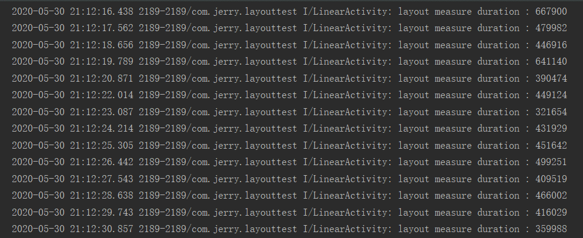

# LayoutTest
一个用于对比约束布局与传统布局耗时的案例

## 对比方式

通过用`LinearLayout`、`RelativeLayout`和`ConstraintLayout`来实现相同UI，并使用`addOnFrameMetricsAvailableListener`方法来监测耗时

## 使用方法

打开应用后点击**线性布局**按钮便会自动执行不同布局各30次，同时在log中输出`layout measure duration`后带纳秒时间

> 注意：只能在android 7.0及以上环境运行

## 得出结论

约束布局相较于线性布局能减少40%的耗时，对于相对布局能减少14%的耗时

